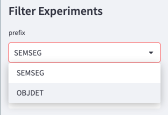

# Use the niceML Dashboard

niceML provides a nice and simple dashboard that allows you to visualize
and explore the results of your machine learning experiments. In this
section, we will show you how to use the `niceml dashboard` command to
access and analyze your experiment data.

## Launching the Dashboard

To launch the niceML dashboard, simply execute the following command in
your terminal or command prompt:

```bash
niceml dashboard
```

This command will start the dashboard using the default configuration
file `configs/dashboard/local.yaml`. When the local dashboard server is
up, the dashboard will open in a new tab in your default web browser.
Otherwise, you can click on the dashboard link in the terminal.

## Exploring Experiment Results

{: width="1000px"}

Once the dashboard is launched, you will be presented with an overview
of all completed trainings and their general configuration. Experiments
are separated by their type, such as Semantic Segmentation (SemSeg). If
you have run different experiment types, you can switch between them
using the prefix filter in the left sidebar.

{: width="200px"}

In the sidebar, you can also filter experiments based on different
criteria, such as the selected model. This allows you to focus on
specific subsets of data and compare the results of different
experiments.

On the main part of the dashboard, each training is listed with its
metrics, configuration, and network data. You can access this
information through the different tabs available. These tabs provide
insights into specific aspects of the experiment, including metrics,
visualizations, and analysis.

## Downloading Experiments

In some cases, you may have run experiments on remote instances or
different machines. The niceML dashboard offers a convenient option
to download the experiment data directly from the dashboard interface.
This feature allows you to access and analyze experiment results even
if the experiment was performed on a different system. This can also
be useful, if you need to share the experiment files with others.

To download an experiment, follow these steps:

1. Switch to the `Download` tab.
2. Select the experiment you want to download from the list of completed
trainings.
3. Choose the file types you want to download. You can select from
various options depending on the available experiment files.
4. Click on the `Download` button.

The experiment will be downloaded to your device, allowing you to access
the experiment data locally.

## Recap

The niceML dashboard is a valuable tool for visualizing and analyzing
your machine learning experiment results. 

You learned to

- launch the dashboard (`niceml dashboard`) to
- access a comprehensive overview of your completed trainings and
- download experiments from a remote instance to your defice via the
`Download` tab for further evaluation or to share them with others.
